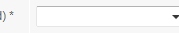
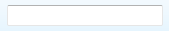
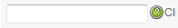
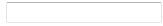
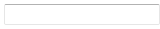
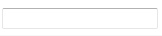
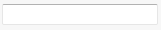

เอกสารข้อกำหนด
============

---------------------------------------------

กำหนดให้ความเหมือนของการเปรียบเทียบอยู่ที่ระดับ 0.8

    ความเหมือน 0.8

เมื่อเปิดโปรแกรม chrome

    เปิด "C:/Program Files (x86)/Google/Chrome/Application/chrome.exe"

และคลิก Address bar

    คลิก "Addressbar"
    หยุด 1 วินาที
    พิมพ์ "http://localhost:8080/project/\n"
    หยุด 1 วินาที

และคลิก Register

    คลิก "Register"
    หยุด 1 วินาที

และคลิก Country

    คลิก "Country"
    พิมพ์ "Thailand"
    หยุด 1 วินาที

และคลิก CompanyName

    คลิก "CompanyName"
    พิมพ์ "ttcompany"
    หยุด 1 วินาที

และคลิก VAT

    คลิก "VAT"
    พิมพ์ "123"
    หยุด 1 วินาที

และคลิก CompanyPhone

    คลิก "Companyphone"
    พิมพ์ "044555555"
    หยุด 1 วินาที

และคลิก StreetName

    คลิก "streetname"
    พิมพ์ "mroad"
    หยุด 1 วินาที

และคลิก StreetNumber

    คลิก "streetNumber"
    พิมพ์ "111"
    หยุด 1 วินาที

และคลิก PostCode

    คลิก "postcode"
    พิมพ์ "30000"
    หยุด 1 วินาที

 และคลิก Town

    คลิก "streetNumber"
    พิมพ์ "mroad"
    หยุด 1 วินาที

 และคลิก Town

    คลิก "streetNumber"
    พิมพ์ "mroad"
    หยุด 1 วินาที

 และคลิก Town

    คลิก "streetNumber"
    พิมพ์ "mroad"
    หยุด 1 วินาที

 และคลิก Town

    คลิก "streetNumber"
    พิมพ์ "mroad"
    หยุด 1 วินาที

 และคลิก Town

    คลิก "streetNumber"
    พิมพ์ "mroad"
    หยุด 1 วินาที

ทำงานเสร็จแล้วปิดโปรแกรม

    ปิด