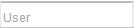
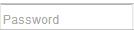
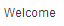
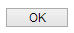
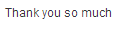

เอกสารข้อกำหนด
================

ข้อกำหนดที่ 1. เรื่องตรวจสอบการแก้ไขข้อมูล
---------------------------------------------

กำหนดให้ความเหมือนของการเปรียบเทียบอยู่ที่ระดับ 0.8

    ความเหมือน 0.8

เมื่อเปิดโปรแกรม chrome

    เปิด "C:\\Program Files\\Google\\Chrome\\Application\\Chrome.exe"

และคลิก Address bar 

    คลิก "Addressbar"
    หยุด 1 วินาที
    พิมพ์ "http://localhost:8080/project/\n"
    หยุด 3 วินาที

และคลิก User และ Password   

    เจอ "เครื่องบิน"
    คลิก "User"
    พิมพ์ "admin"
    คลิก "Pword"
    พิมพ์ "1234"

และคลิก Log In 

    คลิก "Log In"

และเจอ Welcome  

    เจอ "Welcome"
    คลิก "okLonin"
    หยุด 1 วินาที

และคลิก Check status 

    คลิก "Edit status"
    หยุด 2 วินาที

และคลิกแก้ไขข้อมูล   

    เจอ "ตารางStatus"
    คลิก "Edit"
    เจอ "หน้าEdit"

และคลิก Status of pay 

    คลิก "Status of pay"
    พิมพ์ "no "

และบันทึกข้อมูล  

    คลิก "save"
    หยุด 1 วินาที
    เจอ "ข้อความsave"
    คลิก "ok Save"

และกลับมาหน้าแรก 

    คลิก "re"
    หยุด 2 วินาที

แล้ว 

    เจอ "Thank you so much"

ทำงานเสร็จแล้วปิดโปรแกรม

    ปิด

ข้อกำหนดที่ 2. เรื่องตรวจสอบการแก้ไขข้อมูลยกเลิก
---------------------------------------------
กำหนดให้ความเหมือนของการเปรียบเทียบอยู่ที่ระดับ 0.8

    ความเหมือน 0.8

เมื่อเปิดโปรแกรม chrome

    เปิด "C:\\Program Files\\Google\\Chrome\\Application\\Chrome.exe"

และคลิก Address bar 

    คลิก "Addressbar"
    หยุด 1 วินาที
    พิมพ์ "http://localhost:8080/project/\n"
    หยุด 3 วินาที

และคลิก User และ Password   

    เจอ "เครื่องบิน"
    คลิก "User"
    พิมพ์ "admin"
    คลิก "Pword"
    พิมพ์ "1234"

และคลิก Log In 

    คลิก "Log In"

และเจอ Welcome  

    เจอ "Welcome"
    คลิก "okLonin"
    หยุด 1 วินาที

และคลิก Check status 

    คลิก "Edit status"
    หยุด 2 วินาที

และคลิกแก้ไขข้อมูล   

    เจอ "ตารางStatus"
    คลิก "Edit"
    เจอ "หน้าEdit"

และยกเลิก 

    คลิก "cancel"

แล้ว 

    เจอ "หน้าแรกs"

ทำงานเสร็จแล้วปิดโปรแกรม

    ปิด